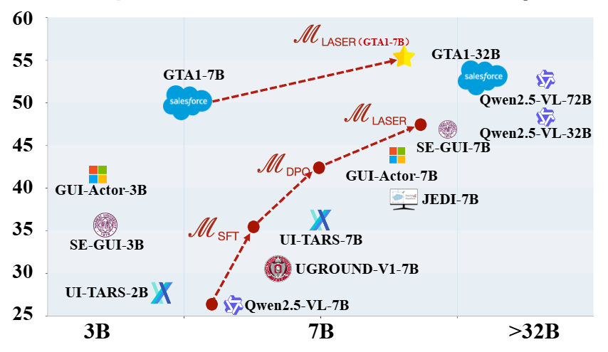
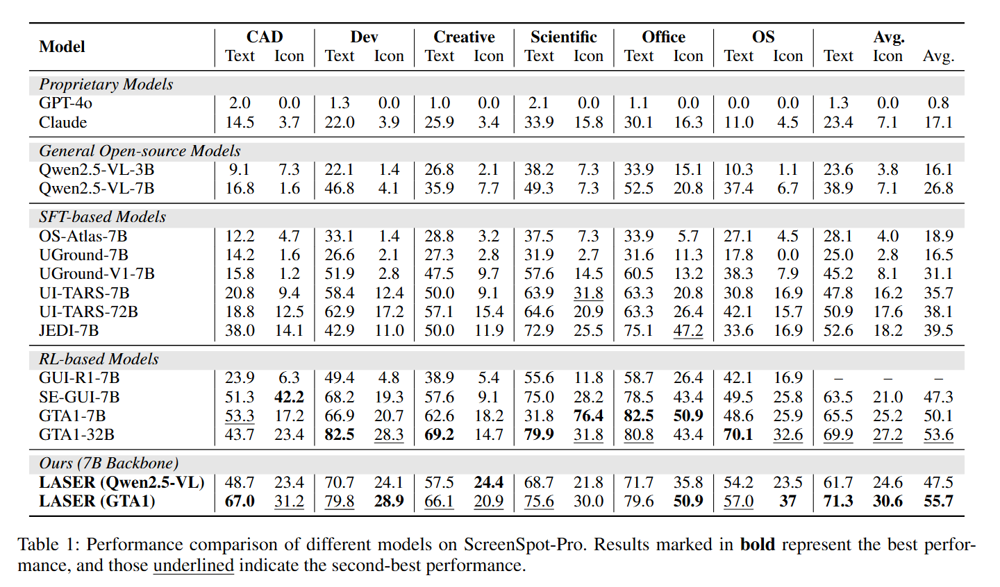
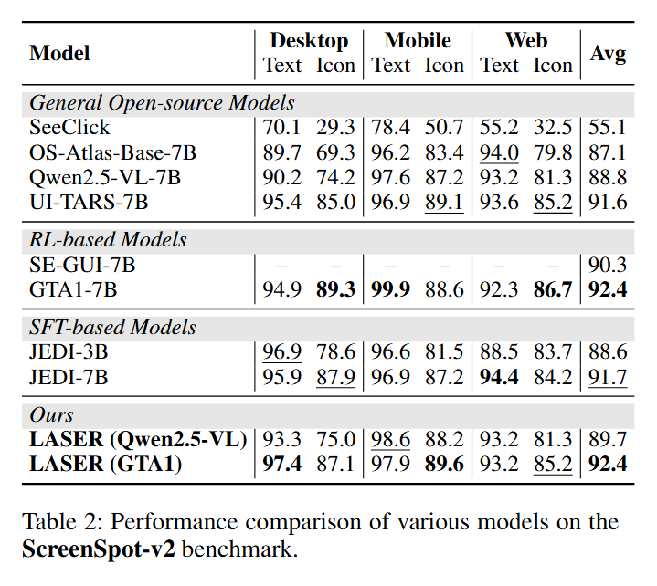
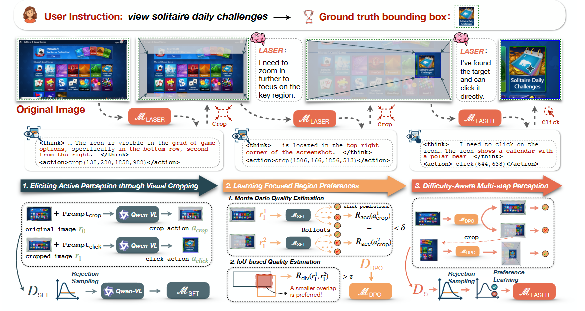

<!-- <h1 align="center">
  
  Learning Active Perception via Self-Evolving Preference Optimization for GUI Grounding
</h1> -->
<!-- <table>
  <tr>
    <td></td>
    <td><h1>Learning Active Perception via Self-Evolving Preference Optimization for GUI Grounding</h1></td>
  </tr>
</table> -->
<!-- <table>
  <tr>
    <td></td>
    <td><h1>Learning Active Perception via Self-Evolving Preference Optimization for GUI Grounding</h1></td>
  </tr>
</table> -->

<!-- <h1>
  
  Learning Active Perception via Self-Evolving Preference Optimization for GUI Grounding
</h1> -->

<!-- <table style="border: none;">
  <tr style="border: none;">
    <td style="border: none; vertical-align: middle;">
      
    </td>
    <td style="border: none; vertical-align: middle; padding-left: 15px;">
      <h1>Learning Active Perception via Self-Evolving Preference Optimization for GUI Grounding</h1>
    </td>
  </tr>
</table> -->
<p align="center">
  <!--  -->
  
</p>

<!-- <div>

<h1 align="center">
  Learning Active Perception via Self-Evolving Preference Optimization for GUI Grounding
</h1>
</div> -->
<div style="display: flex; align-items: center; justify-content: center; gap: 20px;">
  
  <h1 style="margin: 0;">
    Learning Active Perception via Self-Evolving Preference Optimization for GUI Grounding
  </h1>
</div>


<div align="center"> 

[](https://arxiv.org/abs/2509.04243v1)
[](https://wwfnb.github.io/Laser)
[](https://huggingface.co/datasets/qqer/laser_gui_grounding_training_data/tree/main)
[](https://opensource.org/licenses/MIT) 
[](https://opennlg.cn/)
</div>

<p align="center">
🤗 <a href="https://www.modelscope.cn/models/wangwanfu/Laser-Qwen2.5-vl" target="_blank">Laser-7B</a> ｜
🤗 <a href="https://www.modelscope.cn/models/wangwanfu/Laser-GTA1-7B" target="_blank">Laser-7B-GTA1</a> |
 <a href="https://www.modelscope.cn/models/wangwanfu/Laser-Qwen2.5-vl" target="_blank">Laser-7B</a> |
 <a href="https://www.modelscope.cn/models/wangwanfu/Laser-GTA1-7B" target="_blank">Laser-7B-GTA1</a> 
</p>


<h5 align="center"> If you like our project, please give us a star ⭐ on GitHub for the latest update.</h5>

## 📣 Latest News
<!-- 
- **[May 1, 2025]**: 🤗 **[WebThinker Model Collection](https://huggingface.co/collections/lixiaoxi45/webthinker-6812d5fd1287ee53d68f0557)** is now available on Hugging Face. You can deploy our optimized models for your deep research tasks.
- **[May 1, 2025]**: 📄 Our paper is now available on **[arXiv](https://arxiv.org/abs/2504.21776)** and **[Hugging Face](https://huggingface.co/papers/2504.21776)**.
- **[March 31, 2025]**: 🎉 **[Laser HomePage](https://wwfnb.github.io/Laser/)** launched with comprehensive project details. -->
- **[September 3, 2025]**: 🚀 Full codebase released. Laser now supports self-envloving pipeline with any models like [Qwen2.5-VL-7B](https://huggingface.co/Qwen/Qwen2.5-VL-7B-Instruct) or [GTA1-7B](https://huggingface.co/HelloKKMe/GTA1-7B).


# Release Plans
- [x] Code
  - [x] Data Generation
  - [x] Training
  - [x] Evaluation
- [x] Model
  - [x] Laser(qwen2.5_vl-7b)
  - [x] Laser(GTA1-7b)
- [x] [Training Dataset](https://huggingface.co/datasets/qqer/laser_gui_grounding_training_data/tree/main)


## 💡 Overview
<p align="center">
  
</p>

**Laser** is a self-evolving optimization framework, which nables the model to bootstrap its active perception capabilities through rejection sampling–based SFT and region-wise preference learning, without relying on extensive human supervision.

### 📊 Overall Performance


<p align="center">
  
  <span style="display:inline-block; width:5%;"></span>
  
</p>
As shown above, the evaluation covers six GUI domains
and two task types (Text and Icon grounding). Our method,
LASER, consistently outperforms previous models in terms
of both overall grounding accuracy and generalization abil-
ity across different domains, demonstrating the effectiveness
and robustness of our self-evolving training strategy.

### ✨ The Laser Framework

<p align="center">
  
</p>
<!--  -->

The framework of **Laser** is above. Given a user instruction and the original image, the trained MLASER
model progressively focuses on key regions through a multi-step reasoning process. At each step, the Visual CoT captures
critical cues (highlighted in red within the <think> tag) based on the current focus region. Below, we also illustrate the multi-
stage self-evolving optimization process that elicits LASER’s multi-step active perception capabilities

- **Eliciting Active Perception through Visual Cropping.** Given the paired training data, we prompt the VLM back-
bone M<sub>raw</sub> to predict a focused region. The correspond-
ing region is then cropped from the original image and
integrated into the CoT as visual context, guiding the
model toward accurate click-coordinate prediction. To
improve the quality of reasoning trajectories, we adopt
a STaR-style rejection sampling strategy to construct the
dataset D<sub>sft</sub>, which is used to finetune M<sub>sft</sub>.
- **Learning Focused Region Preferences.** We sample mul-
tiple reasoning trajectories from M<sub>sft</sub> and estimate
region-wise preferences using Monte Carlo Estimation.
An IoU-based filter is applied to remove low-quality can-
didates. The resulting preference pairs dataset D<sub>dpo</sub> are
used to train a stronger model M<sub>dpo</sub> via DPO.
- **Difficulty-Aware Multi-step Perception.** While M<sub>dpo</sub>
supports single-step perception, it is prone to failure in
complex scenarios that demand deeper reasoning. To
overcome this limitation, we allow M<sub>dpo</sub> to iteratively
generate multi-step reasoning trajectories, enabling the
construction of a diverse and difficulty-aware training
data. The final model is then trained on this multi-step
dataset D<sub>⟳</sub>, making it with the ability to dynamically ad-
just reasoning depth based on the difficulty of the query.


# 🔧 Installation

##  Install LLaMA-Factory
```bash
conda create --name llama_factory python==3.11
conda activate llama_factory
git clone --depth 1 https://github.com/hiyouga/LLaMA-Factory.git
cd LLaMA-Factory
pip install -e ".[torch,metrics]" --no-build-isolation
```

## Install Laser
```bash
git clone https://github.com/wwfnb/Laser.git
conda create --name Laser python==3.11
conda activate Laser
cd Laser
pip install qwen-vl-utils
pip install 'vllm>0.7.2'
pip install -e .
```
The two environments are used separately. Laser is used for data generation and evaluation, while LLaMA-Factory is used for model training.

# 🛠️ Data Generation

The project uses Laser for data generation. Before generating data, you need to download the raw dataset and preprocess it.
Make sure you are in the Laser environment.

## 1️⃣ Step 1: Preprocessing

### 📂 Download Dataset
The data used for generation comes from [GTA1: GUI Test-time Scaling Agent](https://arxiv.org/pdf/2507.05791), available on Hugging Face: [grounding_dataset](https://huggingface.co/datasets/HelloKKMe/grounding_dataset/tree/main).Please download the dataset and place it under `data/opensource_data`:
```bash
mkdir data/opensource_data
# download the grounding_dataset
huggingface-cli download --repo-type dataset --resume-download "HelloKKMe/grounding_dataset" --local-dir "data/opensource_data"
# unzip the images
cd data/opensource_data
unzip image.part.aa
```
### ⚙️ Preprocess Dataset
We preprocess the dataset using the following script:

```bash
python src/laser/prodata_para.py
```
The processed dataset is stored in JSONL format, where each line corresponds to one sample.

Each sample contains:
<pre>
{
  "image_url": "image/dataset/Aria-UI_Data/web/images/screenshot_bb37986a-b810-44db-a28b-5cf5d5bd97cd_part_5.png",
  "instruction": "manage my information preferences.",
  "action_type": null,
  "coordinate": [854, 1034, 1062, 1068],
  "id": "47215f78-38f1-497a-8963-e3538ee32bd7",
  "source": "aria"
}</pre>
💡 Notes:

In the original [grounding_dataset](https://huggingface.co/datasets/HelloKKMe/grounding_dataset/tree/main), bounding box coordinates were normalized to [0, 1000].
During our preprocessing, they are converted into absolute pixel values based on the corresponding image resolution.

## 2️⃣ Step 2: Generation
We generate our dataset in **four stages**, each contributing to a specific training purpose.  
To make it easier to follow, we group the data generation steps by **purpose** and list the corresponding scripts.

### 🔍 **Eliciting Active Perception through Visual Cropping**
  - *Stage 1: Single-step SFT Data Generation* 
```bash
python src/laser/generator/single_step_sft_generator.py
```
### 🎯 **Learning Focused Region Preferences**
  - *Stage 2: Single-step DPO Data Generation* 
```bash
python src/laser/generator/single_step_dpo_generator.py
```
### 🧩 **Difficulty-Aware Multi-step Perception**
  - *Stage 3: Multi-step SFT Data Generation*  
```bash
python src/laser/generator/multi_step_sft_generator.py
```
  - *Stage 4: Multi-step SFT Data Generation*
```bash
python src/laser/generator/multi_step_dpo_generator.py
```

After running the scripts, the processed SFT and DPO datasets will be saved under:
```bash
data/llamafactory_training_data
```
They will follow the LLaMA-Factory training format, making them ready for immediate use in training.
# 🏋️‍♂️ Training

## 📂 Dataset Preparation
You can either construct the datasets using the data generation process described above, or directly download our training data to start model training.
You can download our training data from [Hugging Face](https://huggingface.co/datasets/qqer/laser_gui_grounding_training_data/tree/main).
The dataset is split into multiple parts, e.g.:
```bash
llamafactory_training_data.tar.gz.part_aa
llamafactory_training_data.tar.gz.part_ab
...
```
Use `cat` to merge them into a single archive:
```bash
cat llamafactory_training_data.tar.gz.part_* > llamafactory_training_data.tar.gz
```
Then extract it under the data/ directory:
```bash
mkdir -p data
tar -xzvf llamafactory_training_data.tar.gz -C data
```

## 🚀 Start Training
We train our models in four stages, using the datasets prepared above.
Each stage focuses on a specific training purpose.
Make sure you are in the LLaMA-Factory training environment.
### 🔍 **Eliciting Active Perception through Visual Cropping**
  - *Stage 1: Single-step SFT Training* 
```bash
bash scripts/train/train_single_sft.sh
```
### 🎯 **Learning Focused Region Preferences**
  - *Stage 2: Single-step DPO Training* 
```bash
bash scripts/train/train_single_dpo.sh
```
### 🧩 **Difficulty-Aware Multi-step Perception**
  - *Stage 3: Multi-step SFT Training*  
```bash
bash scripts/train/train_multi_sft.sh
```
  - *Stage 4: Multi-step SFT Training*
```bash
bash scripts/train/train_multi_dpo.sh
```


# 📊 Evaluation
We evaluate **Laser** on two widely-used GUI grounding benchmarks:**[ScreenSpot-Pro](https://huggingface.co/datasets/likaixin/ScreenSpot-Pro)** and **[ScreenSpot-V2](https://huggingface.co/datasets/OS-Copilot/ScreenSpot-v2)**. Put the ScreenSpot-Pro and ScreenSpot-V2 under `data/benchmark`.
Make sure you are in the **Laser** environment and have **downloaded the datasets**.  We provide scripts for easy evaluation:

### Evaluate on **ScreenSpot-Pro**
```bash
bash scripts/eval/eval_sceenspot_pro.sh
```
### Evaluate on **ScreenSpot-V2**
```bash
## process the data, just once.
python scripts/transfer.py
## evaluate
bash scripts/eval/eval_screenspot_v2.sh
```

## 📄 Citation

If you find this work helpful, please cite our paper:
```bibtex
@misc{wang2025learningactiveperceptionselfevolving,
      title={Learning Active Perception via Self-Evolving Preference Optimization for GUI Grounding}, 
      author={Wanfu Wang and Qipeng Huang and Guangquan Xue and Xiaobo Liang and Juntao Li},
      year={2025},
      eprint={2509.04243},
      archivePrefix={arXiv},
      primaryClass={cs.CV},
      url={https://arxiv.org/abs/2509.04243}, 
}
```

## 📄 License

This project is released under the [MIT License](LICENSE).

<!-- ## 📞 Contact

For any questions or feedback, please reach out to us at [wwf](). -->
