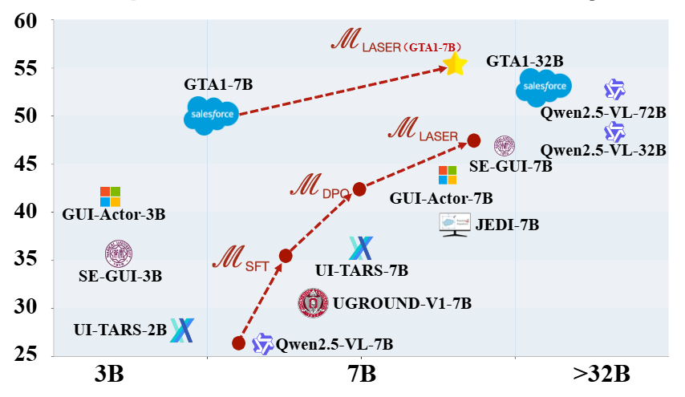
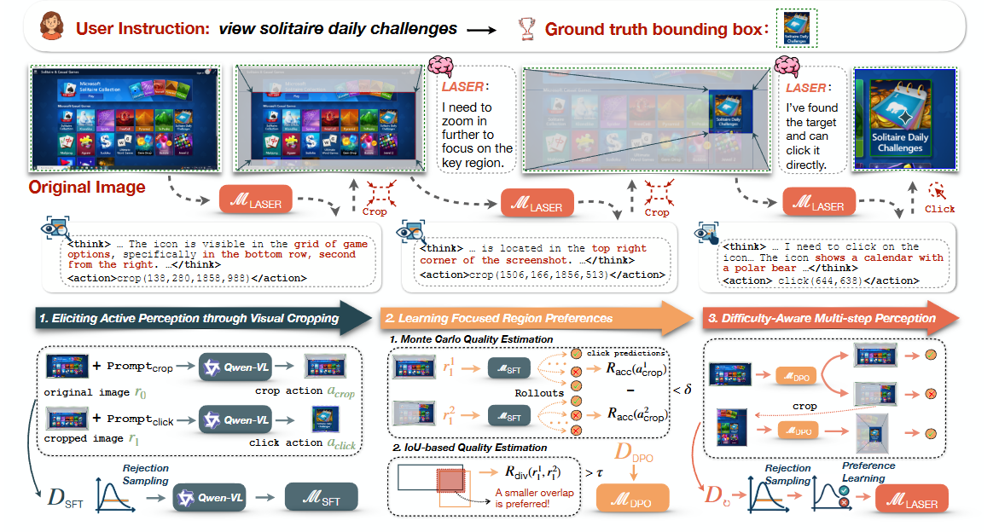

<h1 align="center"> Learning Active Perception via Self-Evolving Preference Optimization for GUI Grounding</a></h1>


<div align="center"> 

[](https://foremost-beechnut-8ed.notion.site/WebThinker-Empowering-Large-Reasoning-Models-with-Deep-Research-Capability-d13158a27d924a4b9df7f9ab94066b64) 
[](https://arxiv.org/abs/2504.21776)
[](https://huggingface.co/papers/2504.21776)
[](https://opensource.org/licenses/MIT) 
[](https://www.python.org/downloads/release/python-390/) 
[](https://x.com/kakakbibibi/status/1917768235069628823)
</div>

<p align="center">
🤗 <a href="https://huggingface.co/lixiaoxi45/WebThinker-QwQ-32B" target="_blank">Laser-7B</a> ｜
🤗 <a href="https://huggingface.co/lixiaoxi45/WebThinker-R1-7B" target="_blank">Laser-7B-GTA1</a>
</p>


<h5 align="center"> If you like our project, please give us a star ⭐ on GitHub for the latest update.</h5>

## 📣 Latest News

- **[May 1, 2025]**: 🤗 **[WebThinker Model Collection](https://huggingface.co/collections/lixiaoxi45/webthinker-6812d5fd1287ee53d68f0557)** is now available on Hugging Face. You can deploy our optimized models for your deep research tasks.
- **[May 1, 2025]**: 📄 Our paper is now available on **[arXiv](https://arxiv.org/abs/2504.21776)** and **[Hugging Face](https://huggingface.co/papers/2504.21776)**.
- **[March 31, 2025]**: 🎉 **[Laser HomePage](https://wwfnb.github.io/Laser/)** launched with comprehensive project details.
- **[August 28, 2025]**: 🚀 Full codebase released. Laser now supports self-envloving pipeline with any models like Qwen2.5-VL-7B or GTA1-7B.

## 💡 Overview
<p align="center">
  
</p>

**Laser** is a self-evolving optimization framework, which nables the model to bootstrap its active perception capabilities through rejection sampling–based SFT and region-wise preference learning, without relying on extensive human supervision

Unlike existing methods, we ...........................................

### 📊 Overall Performance


<p align="center">
  
  <span style="display:inline-block; width:5%;"></span>
  
</p>
As shown above, s. The evaluation covers six GUI domains
and two task types (Text and Icon grounding). Our method,
LASER, consistently outperforms previous models in terms
of both overall grounding accuracy and generalization abil-
ity across different domains, demonstrating the effectiveness
and robustness of our self-evolving training strategy.

### ✨ The WebThinker Framework

<p align="center">
  
</p>
<!--  -->

The framework of **Laser** is above. Given a user instruction and the original image, the trained MLASER
model progressively focuses on key regions through a multi-step reasoning process. At each step, the Visual CoT captures
critical cues (highlighted in red within the <think> tag) based on the current focus region. Below, we also illustrate the multi-
stage self-evolving optimization process that elicits LASER’s multi-step active perception capabilities

**Key Features:**
- **Eliciting Active Perception through Visual Cropping.** Given the paired training data, we prompt the VLM back-
bone MRAW to predict a focused region. The correspond-
ing region is then cropped from the original image and
integrated into the CoT as visual context, guiding the
model toward accurate click-coordinate prediction. To
improve the quality of reasoning trajectories, we adopt
a STaR-style rejection sampling strategy to construct the
dataset DSFT, which is used to finetune MSFT.
- **Learning Focused Region Preferences.** We sample mul-
tiple reasoning trajectories from M_SFT and estimate
region-wise preferences using Monte Carlo Estimation.
An IoU-based filter is applied to remove low-quality can-
didates. The resulting preference pairs dataset DDPO are
used to train a stronger model MDPO via DPO.
- **Difficulty-Aware Multi-step Perception.** While MDPO
supports single-step perception, it is prone to failure in
complex scenarios that demand deeper reasoning. To
overcome this limitation, we allow MDPO to iteratively
generate multi-step reasoning trajectories, enabling the
construction of a diverse and difficulty-aware training
data. The final model is then trained on this multi-step
dataset D⟳, making it with the ability to dynamically ad-
just reasoning depth based on the difficulty of the query


# 🔧 Installation

##  Install LLaMA-Factory
```bash
conda create --name llama_factory python==3.11
conda activate llama_factory
git clone --depth 1 https://github.com/hiyouga/LLaMA-Factory.git
cd LLaMA-Factory
pip install -e ".[torch,metrics]" --no-build-isolation
```

## Install Laser
```bash
git clone https://github.com/wwfnb/Laser.git
conda create --name Laser python==3.11
conda activate Laser
cd laser
pip install qwen-vl-utils
pip install 'vllm>0.7.2'
pip install -e .
```
The two environments are used separately: Laser for data generation and LLaMA-Factory for model training.

# 🛠️ Data Generation
The project uses Laser for data generation. Before generating data, you need to download the raw dataset and preprocess it.
Make sure you are in the Laser environment.

## 1️⃣ Step 1: Data Preprocessing

### 📂 Download Dataset
The data used for generation comes from [GRPO for GUI Grounding Done Right](https://huggingface.co/blog/HelloKKMe/grounding-r1), available on Hugging Face: [grounding_dataset](https://huggingface.co/datasets/HelloKKMe/grounding_dataset/tree/main).

### ⚙️ Preprocess Dataset
We preprocess the dataset using the following script:

```bash
python src/laser/prodata_para.py
```
The processed dataset is stored in JSONL format, where each line corresponds to one sample.

Each sample contains:
<pre>
{
  "image_url": "image/dataset/Aria-UI_Data/web/images/screenshot_bb37986a-b810-44db-a28b-5cf5d5bd97cd_part_5.png",
  "instruction": "manage my information preferences.",
  "action_type": null,
  "coordinate": [854, 1034, 1062, 1068],
  "id": "47215f78-38f1-497a-8963-e3538ee32bd7",
  "source": "aria"
}</pre>
💡 Notes:

In the original gr1 dataset, bounding box coordinates were normalized to [0, 1000].
During our preprocessing, they are converted into absolute pixel values based on the corresponding image resolution.

## 2️⃣ Step 2: Data Generation
Our dataset is constructed in **four stages**, each corresponding to a specific data generation process.  
You can run the following scripts to generate the corresponding datasets:

1. **Single-step SFT Data Generation**
```bash
python src/laser/generator/single_step_sft_generator.py
```
2. **Single-step DPO Data Generation**
```bash
python src/laser/generator/single_step_dpo_generator.py
```
3. **Multi-step SFT Data Generation**
```bash
python src/laser/generator/multi_step_sft_generator.py
```
4. **Multi-step DPO Data Generation**

# 🏋️‍♂️ Model Training

## 🎛️ Training Parameters

💡 Notes:

Ensure the generated data format is compatible with the model.

Training logs and checkpoints will be saved in ./models.


# 📊 Model Evaluation

## 🎛️ Evaluation Parameters


## 📈 Example Output


## 🏃 Quick Start

### Pre-preparation

#### Model Serving
Before running WebThinker, ensure your reasoning model and auxiliary model are served using vLLM. In our experiments, we use QwQ-32B as the reasoning model and Qwen-32B-Instruct as the auxiliary model. You can also explore other instruction-tuned models as your auxiliary model, which will be used in webpage reading, report writting/editting, evaluation, etc. For detailed instructions on model serving, see [here](https://docs.vllm.ai/en/stable/serving/distributed_serving.html). 

#### Web Parser Client
For better web crawling performance, we recommend setting up a web parser client in `scripts/search/bing_search.py` using [Crawl4AI](https://github.com/unclecode/crawl4ai). This will help handle JavaScript-rendered content and provide more reliable webpage extraction.

Now you can run different inference modes using the provided scripts. Below are examples of how to execute each mode:

### Problem Solving Mode

1. If you would like to ask a single question, run the following command:
```bash
python scripts/run_web_thinker.py \
    --single_question "What is OpenAI Deep Research?" \
    --search_engine "serper" \
    --serper_api_key "YOUR_GOOGLE_SERPER_API" \
    --api_base_url "YOUR_API_BASE_URL" \
    --model_name "QwQ-32B" \
    --aux_api_base_url "YOUR_AUX_API_BASE_URL" \
    --aux_model_name "Qwen2.5-32B-Instruct" \
    --tokenizer_path "PATH_TO_YOUR_TOKENIZER" \
    --aux_tokenizer_path "PATH_TO_YOUR_AUX_TOKENIZER"
```

2. If you would like to run results on benchmarks, run the following command:
```bash
python scripts/run_web_thinker.py \
    --dataset_name gaia \
    --split dev \
    --concurrent_limit 32 \
    --max_search_limit 15 \
    --search_engine "serper" \
    --serper_api_key "YOUR_GOOGLE_SERPER_API" \
    --api_base_url "YOUR_API_BASE_URL" \
    --model_name "QwQ-32B" \
    --aux_api_base_url "YOUR_AUX_API_BASE_URL" \
    --aux_model_name "Qwen2.5-32B-Instruct" \
    --tokenizer_path "PATH_TO_YOUR_TOKENIZER" \
    --aux_tokenizer_path "PATH_TO_YOUR_AUX_TOKENIZER"
```

### Report Generation Mode

1. If you would like to ask a single question, run the following command:
```bash
python scripts/run_web_thinker_report.py \
    --single_question "What are the models of OpenAI and what are the differences?" \
    --search_engine "serper" \
    --serper_api_key "YOUR_GOOGLE_SERPER_API" \
    --api_base_url "YOUR_API_BASE_URL" \
    --model_name "QwQ-32B" \
    --aux_api_base_url "YOUR_AUX_API_BASE_URL" \
    --aux_model_name "Qwen2.5-32B-Instruct" \
    --tokenizer_path "PATH_TO_YOUR_TOKENIZER" \
    --aux_tokenizer_path "PATH_TO_YOUR_AUX_TOKENIZER"
```

2. If you would like to run results on benchmarks, run the following command:
```bash
python scripts/run_web_thinker_report.py \
    --dataset_name glaive \
    --split test \
    --concurrent_limit 32 \
    --search_engine "serper" \
    --serper_api_key "YOUR_GOOGLE_SERPER_API" \
    --api_base_url "YOUR_API_BASE_URL" \
    --model_name "QwQ-32B" \
    --aux_api_base_url "YOUR_AUX_API_BASE_URL" \
    --aux_model_name "Qwen2.5-32B-Instruct" \
    --tokenizer_path "PATH_TO_YOUR_TOKENIZER" \
    --aux_tokenizer_path "PATH_TO_YOUR_AUX_TOKENIZER"
```

**Parameters Explanation:**
- `--dataset_name`: Name of the dataset to use (glaive).
- `--split`: Data split to run (test).
- `--single_question`: The question you want to ask when running in single question mode.
- `--concurrent_limit`: Maximum number of concurrent requests.
- `--max_search_limit`: Maximum number of search queries per reasoning session.
- `--search_engine`: Search engine to use (bing or serper). Default: bing.
- `--serper_api_key`: Your Google Serper API key (not required when using Bing).
- `--bing_subscription_key`: Your Bing Search API subscription key (not required when using Serper).
- `--api_base_url`: Base URL for the main model API.
- `--model_name`: Name of the main model to use.
- `--aux_api_base_url`: Base URL for the auxiliary model API.
- `--aux_model_name`: Name of the auxiliary model to use.

### Run Demo

You can run the demo we have created with the following command, and we will conduct in-depth exploration and thinking based on the questions you input.
```bash
cd demo
streamlit run_demo.py
```

**Note:** Before running, it is necessary to configure the relevant parameters in `demo/settings.py`.

### Benchmarks

The benchmarks we utilize are categorized into two types:
- **Complex Reasoning Benchmarks:** 
    - **PhD-level Science QA:** [GPQA](https://arxiv.org/abs/2311.12022) (198 questions)
    - **General AI Assistant:** [GAIA](https://arxiv.org/abs/2311.12983) (103 questions)
    - **Web Exploration:** [WebWalkerQA](https://arxiv.org/abs/2501.07572) (680 questions)
    - **Extremely Difficult Reasoning Problems:** [Humanity's Last Exam (HLE)](https://arxiv.org/abs/2501.14249) (500 questions)
- **Scientific Report Evaluation:**
    - **General Open-ended Reasoning Problem:** [Reasoning-v1-20m](https://huggingface.co/datasets/glaiveai/reasoning-v1-20m) (30 questions)

All the pre-processed data is available in the `./data/` directory. For GAIA, HLE and Reasoning-v1-20m, we sampled a text-only subset of questions to efficiently conduct our evaluation.


### Evaluation

Our model inference scripts will automatically save the model's input and output texts for evaluation. 

#### Problem Solving Evaluation

You can use the following command to evaluate the model's problem solving performance:

```bash
python scripts/evaluate/evaluate.py \
    --output_path "YOUR_OUTPUT_PATH" \
    --task math \
    --use_llm \
    --api_base_url "YOUR_AUX_API_BASE_URL" \
    --model_name "Qwen2.5-72B-Instruct" \
    --extract_answer
```
**Parameters Explanation:**
- `--output_path`: Path to the model's outputs for evaluation.
- `--task`: Task name. You can always set it to math (suitable for any QA task), unless it is a code task, then set it to code. 
- `--use_llm`: Whether to use the LLM to evaluate the model's performance.
- `--api_base_url`: Base URL for the LLM API.
- `--model_name`: Model name for LLM evaluation.
- `--extract_answer`: Whether to extract the answer from the model's output, otherwise it will use the last few lines of the model's output as the final answer. Only used when `--use_llm` is set to `True`.

#### Report Generation Evaluation

We employ [DeepSeek-R1](https://api-docs.deepseek.com/) and [GPT-4o](https://platform.openai.com/docs/models/gpt-4o) to perform *listwise evaluation* for comparison of reports generated by different models. You can evaluate the reports using:

```bash
python scripts/evaluate/evaluate_report.py \
    --api-base-url "YOUR_API_BASE_URL" \
    --api-key "YOUR_API_KEY" \
    --models "YOUR_MODEL_NAME" \
    --model-to-test-dir "YOUR_MODEL_OUTPUT_DIRECTORY"
```
**Parameters Explanation:**
- `--api-base-url`: Base URL for the LLM API (e.g., "https://openrouter.ai/api/v1" or "https://api.openai.com/v1").
- `--api-key`: Your API key for the LLM service.
- `--models`: A list of model names (e.g., "deepseek/deepseek-r1", "openai/gpt-4o") to be used for evaluating the reports. The script will iterate through these models to get evaluations.
- `--model-to-test-dir`: Path to the directory where the generated reports (markdown files) from your model are stored.


📊 **Report Comparison Available**: 

We've included the complete set of 30 test reports generated by **WebThinker**, **Grok3 DeeperSearch** and **Gemini2.0 Deep Research** in the `./outputs/` directory for your reference and comparison.


## 📄 Citation

If you find this work helpful, please cite our paper:
```bibtex
@article{Li2025WebThinker,
  author       = {Xiaoxi Li and
                  Jiajie Jin and
                  Guanting Dong and
                  Hongjin Qian and
                  Yutao Zhu and
                  Yongkang Wu and
                  Ji{-}Rong Wen and
                  Zhicheng Dou},
  title        = {WebThinker: Empowering Large Reasoning Models with Deep Research Capability},
  journal      = {CoRR},
  volume       = {abs/2504.21776},
  year         = {2025},
  url          = {https://doi.org/10.48550/arXiv.2504.21776},
  doi          = {10.48550/ARXIV.2504.21776},
  eprinttype    = {arXiv},
  eprint       = {2504.21776},
  timestamp    = {Sun, 25 May 2025 20:50:43 +0200},
  biburl       = {https://dblp.org/rec/journals/corr/abs-2504-21776.bib},
  bibsource    = {dblp computer science bibliography, https://dblp.org}
}
```

## 📄 License

This project is released under the [MIT License](LICENSE).

## 📞 Contact

For any questions or feedback, please reach out to us at [wwf]().
